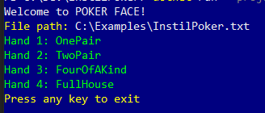

# Poker Face
Read input from a file and convert the specified hands (there may be many) into the name of the corresponding poker hand. 

The name of the hand will be one of:
* High card
* One pair
* Two pair
* Three of a kind
* Straight
* Flush
* Full house
* Four of a kind
* Straight flush
* Royal Flush
The full definition of these hands is here: [Wikipedia - List of Poker Hands](http://en.wikipedia.org/wiki/List_of_poker_hands)

## Usage
* From the route directory, execute the following command
  ```shell
  dotnet run --project .\Instil.Poker.Console\Instil.Poker.Console.csproj
  ```
  More about the `dotnet run` command can be found [here](https://docs.microsoft.com/en-us/dotnet/core/tools/dotnet-run).

* Enter the fully qualified file path to a file containing data to read when prompted.
  
  

* Hit enter
* Determined hands will be output to the console
  
  

* Press any key to exit the application 

## Testing
To run all tests within the solution:
* From the route directory, execute the following command
  ```shell
  dotnet test
  ```
  More about the `dotnet test` command can be found [here](https://docs.microsoft.com/en-us/dotnet/core/tools/dotnet-test).
  